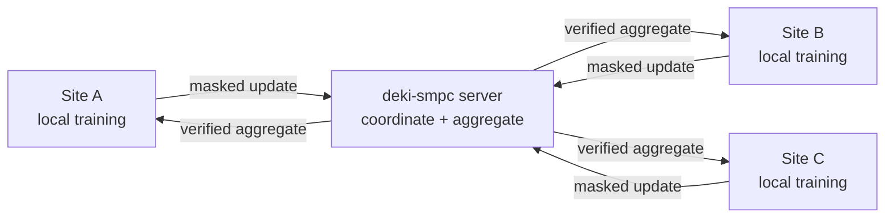

<div align="center">

# deki-smpc

### Secure model aggregation for collaborative learning across organizations

Train together. Keep each participant's model update private. Verify the result
before using it.

<a href="https://www.python.org/">
  
</a>
<a href="https://pytorch.org/">
  
</a>
<a href="docs/protocol-v1.md">
  
</a>
<a href="LICENSE">
  
</a>

</div>

---

deki-smpc brings secure multi-party computation to **cross-silo federated
learning**. It lets a fixed group of organizations—such as hospitals or
research institutes—combine locally trained PyTorch models without sending
their individual model updates to the aggregation service in the clear.

The integration point is intentionally small: each participant hands its
locally trained model to `FedAvgClient`, waits for the other participants, and
receives a new, verified aggregate state dictionary.

> deki-smpc protects the aggregation step. Training data stays at its source, model
> updates are masked before upload, and every participant independently checks
> the combined result.

## Overview

In ordinary federated learning, data remains local but individual model updates
may still be visible to the central coordinator. deki-smpc closes that gap with a
round-based secure aggregation protocol built for stable groups of known
participants.



During each round, the clients create fresh shared masking material. The masks
hide every individual upload but cancel when all updates are added together.
The server publishes the sum, and clients verify its integrity before turning
it back into PyTorch tensors.

### Why deki-smpc?

- **Private individual updates** — the service stores and processes masked
  model artifacts, not clear participant updates.
- **Familiar PyTorch workflow** — aggregation returns a state dictionary that
  can be loaded with `model.load_state_dict(...)`.
- **Client-side trust** — participants authenticate one another and reject a
  modified or malformed aggregate.
- **Round-local security** — keys, masks, and integrity material are freshly
  generated for every aggregation round.
- **Production-minded behavior** — HTTPS by default, bounded retries, one
  caller-controlled deadline, cancellation, and typed errors.

## Getting started

### Requirements

- Python 3.12 or newer
- PyTorch 2.13 or newer
- A running deki-smpc v1 server
- At least three enrolled participants using the same model schema

Install the client from a checkout:

```bash
python -m pip install .
```

For development and testing:

```bash
python -m pip install -e '.[test]'
```

### Aggregate a model

The federation operator creates a round and shares its `round_id` with every
participating site. Each site then calls the same client API with its locally
trained model:

```python
from datetime import timedelta

from deki_smpc import FedAvgClient

model = ...  # your locally trained torch.nn.Module

with FedAvgClient(
    base_url="https://aggregation.example.org",
    federation_id="hospital-network",
    client_id="site-a",
    auth_token=site_bearer_token,
    identity_private_key=site_private_key_base64,
    trusted_signing_keys={
        "site-a": site_a_public_key_base64,
        "site-b": site_b_public_key_base64,
        "site-c": site_c_public_key_base64,
    },
    ca_bundle="/etc/ssl/certs/federation-ca.pem",
) as client:
    aggregate = client.aggregate(
        model=model,
        round_id=round_id,
        timeout=timedelta(minutes=30),
    )

model.load_state_dict(aggregate)
```

The input model is never mutated. deki-smpc returns a new state dictionary only
after its schema, artifact, digest, and aggregate integrity have been checked.

Want to see the complete workflow first? Follow the
**[three-site MNIST walkthrough](docs/getting-started-mnist.md)** to provision a
local federation, train at three participants, and run a real secure
aggregation round.

## Protocol at a glance

| | deki-smpc v1 |
| --- | --- |
| Designed for | Cross-silo federated learning with known participants |
| Participants | A complete, fixed set of at least three sites |
| Aggregation | Equal-weight mean or sum |
| Individual uploads | Pairwise-masked `int64` tensors |
| Result | Verified PyTorch state dictionary at every participant |
| Model artifacts | Safetensors only |
| Transport | HTTPS by default |

### Tensor behavior

deki-smpc chooses sensible defaults for a PyTorch state dictionary: floating-point
tensors are averaged, while integer tensors stay local. Individual tensors can
opt into a different policy when needed.

| Policy | Behavior |
| --- | --- |
| `MEAN` | Equal-weight mean across all participants |
| `SUM` | Sum across all participants |
| `KEEP_LOCAL` | Preserve that site's local value; never upload it |

```python
aggregate = client.aggregate(
    model=model,
    round_id=round_id,
    tensor_policies={"running_total": "SUM"},
)
```

Every participant must use the same ordered model schema, precision, policies,
and participant manifest. A mismatch ends the round with a typed protocol
error.

## Client and server

deki-smpc is split into two focused repositories:

| Repository | For | Responsibility |
| --- | --- | --- |
| **`deki-smpc`** (this repository) | Participating sites | Protect updates and verify results |
| **`deki-smpc-server`** | Service operators | Coordinate rounds and publish aggregates |

The server is deliberately not trusted with individual clear updates. It does
learn the final aggregate, which is the intended output of the protocol.

## Documentation

- **[End-to-end MNIST tutorial](docs/getting-started-mnist.md)** — run a full
  three-participant federation locally
- **[Client API](docs/client-api.md)** — configuration, callbacks, policies,
  and errors
- **[Security model](docs/security-model.md)** — guarantees, assumptions, and
  trust boundaries
- **[Protocol v1](docs/protocol-v1.md)** — cryptographic and arithmetic design
- **[Wire format v1](docs/wire-format-v1.md)** — canonical HTTP and artifact
  contract
- **[Development](docs/development.md)** — tests, tooling, and local validation
- **[Changelog](CHANGELOG.md)** — releases and notable changes

## Scope and security

deki-smpc v1 favors a simple, auditable protocol for stable federations. All
committed participants must complete the round; a dropout causes the round to
expire or be aborted. Aggregation is equal-weight, and input quality or model
poisoning remains a federation-governance concern. See the
[security model](docs/security-model.md) for the precise guarantees and
non-goals.

## Citation

If deki-smpc supports your research, please cite:

> Hamm, B., Kirchhoff, Y., Rokuss, M., Schader, P., Neher, P.,
> Parampottupadam, S., Floca, R., & Maier-Hein, K. (2025). *Efficient
> Privacy-Preserving Medical Cross-Silo Federated Learning*.
> <https://doi.org/10.36227/techrxiv.174650601.13181048/v1>

## License

deki-smpc is distributed under the terms of the [MIT License](LICENSE).
